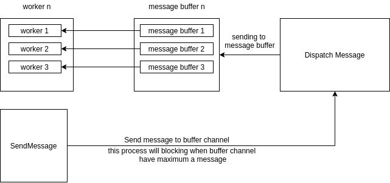

# Worker 

* reliable queueing for all queues using
* customize concurrency per queue
* responds to Unix signals to safely wait for jobs to finish before exiting.
* provides stats on what jobs are currently running
* well tested

Concept of Buffer Channel




Buffer Channel
```go
	var wg sync.WaitGroup
	// Handle SIGINT and SIGTERM.
	ch := make(chan os.Signal)


	var worker = worker.NewWorkerWithBuffer(worker.ConfigWorkerWithBuffer{
		MessageSize:100,
		Worker:5,
		FN:func(payload string) error {
			//time.Sleep(1 * time.Second)
			f, _ := os.Create(fmt.Sprint("./temp/file_", payload))
			defer f.Close()
			return nil
		},
	})


	wg.Add(1)
	go func() {
		defer wg.Done()
		for i := 0; i < 100; i++ {
			worker.SendJob(nil,fmt.Sprint(i))
		}
	}()
	time.Sleep(time.Second * 1)

	wg.Add(1)
	go func() {
		defer wg.Done()
		worker.Start()
		fmt.Println("close run worker")
	}()

	wg.Add(1)
	go func() {
		defer wg.Done()
		signal.Notify(ch, syscall.SIGINT, syscall.SIGTERM)
		log.Println(<-ch)
		worker.Stop()
	}()

	wg.Wait()
```

Example usage:

```go
var wg sync.WaitGroup
// Handle SIGINT and SIGTERM.
ch := make(chan os.Signal)

var worker = worker.NewWorker(100, func(payload string) error {
    fmt.Println(payload)
    return nil
})

wg.Add(1)
go func() {
    defer wg.Done()
    worker.Start()
    fmt.Println("close run worker")
}()

wg.Add(1)
go func() {
    defer wg.Done()
    signal.Notify(ch, syscall.SIGINT, syscall.SIGTERM)
    log.Println(<-ch)
    worker.Stop()
}()

wg.Add(1)
go func() {
    defer wg.Done()
    for i := 0; i < 100; i++ {
        worker.SendJob(fmt.Sprintf(" msg :%d", i))
    }
}()

wg.Wait()

```

